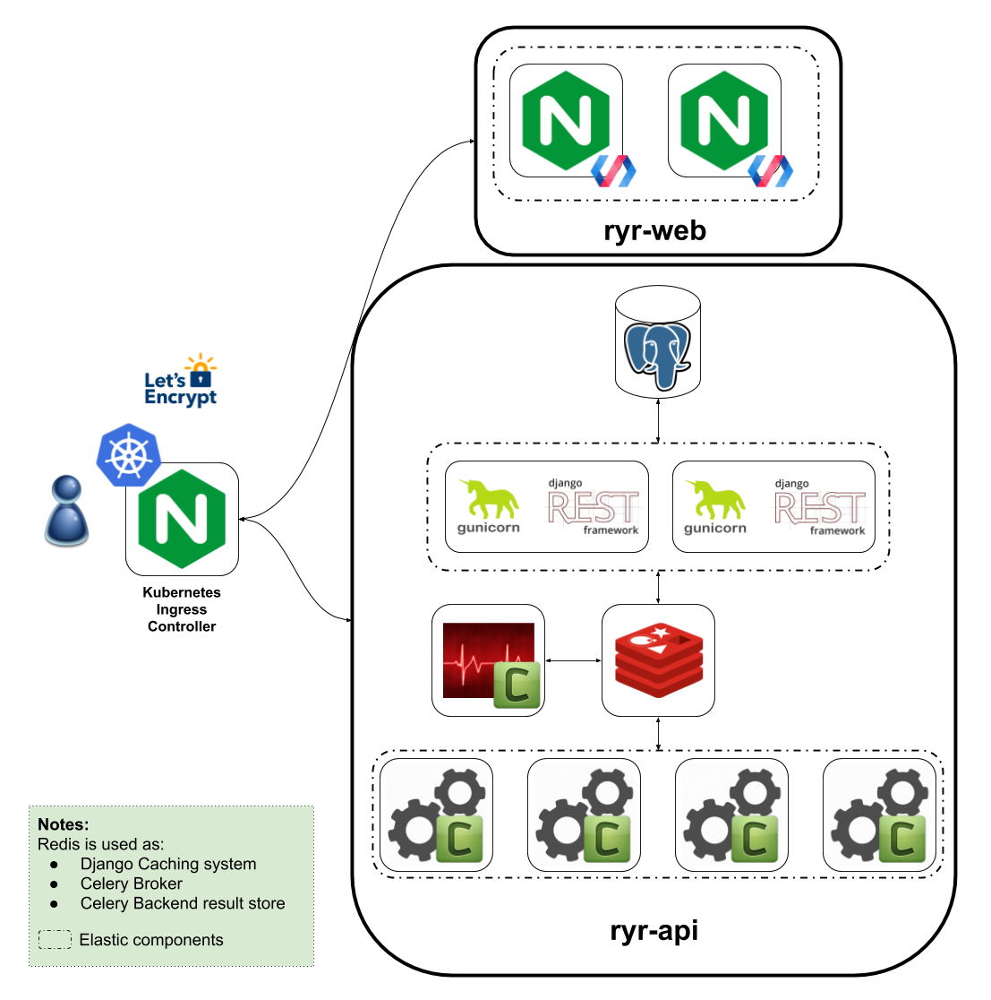

# Technical overview

Request Yo Racks is a collection of open source projects hosted on Github.

## Key principles

* Everything must be automated.
* Everything must be documented.
* Everything must be containerized.

## Infrastructure design

.

## API

The API is made with [Python](https://www.python.org/), using
[Django REST Framework](http://www.django-rest-framework.org/) (DRF), and served by [gUnicorn](http://gunicorn.org/)

The tasks are handled by [Celery](http://docs.celeryproject.org/en/latest/index.html) to process them
asynchronously or in parallel. [Flower](https://flower.readthedocs.io/en/latest/) is used to monitor them.

All the Python documentation is written in [reStructuredText](ttp://thomas-cokelaer.info/tutorials/sphinx/rest_syntax.html)
and generated with [Sphinx](http://www.sphinx-doc.org/en/stable/).

Repository: [API](https://github.com/request-yo-racks/api)

## Web

The frontend is a [Progressive Web Application (PWA)](https://developers.google.com/web/progressive-web-apps/).
The [Polymer](https://www.polymer-project.org/) library offers the ability to quickly create a PWA implementing the
[PRPL pattern](https://developers.google.com/web/fundamentals/performance/prpl-pattern/), and to build
[web components](https://www.webcomponents.org/).

Repository: [Web](https://github.com/request-yo-racks/web)

## Infrastructure

The projects are fully containerized using [Docker](https://docs.docker.com/engine/understanding-docker/) and deployed
on a [Kubernetes](https://kubernetes.io/) cluster on the [GCP](https://cloud.google.com/).
